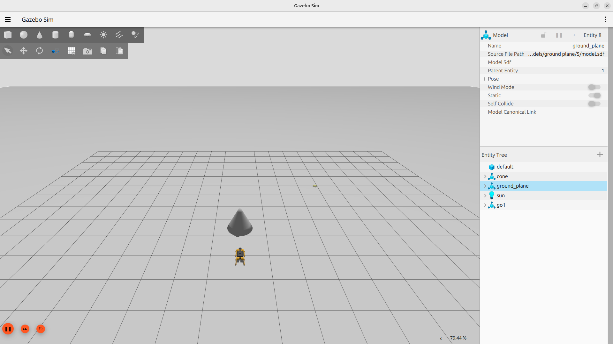
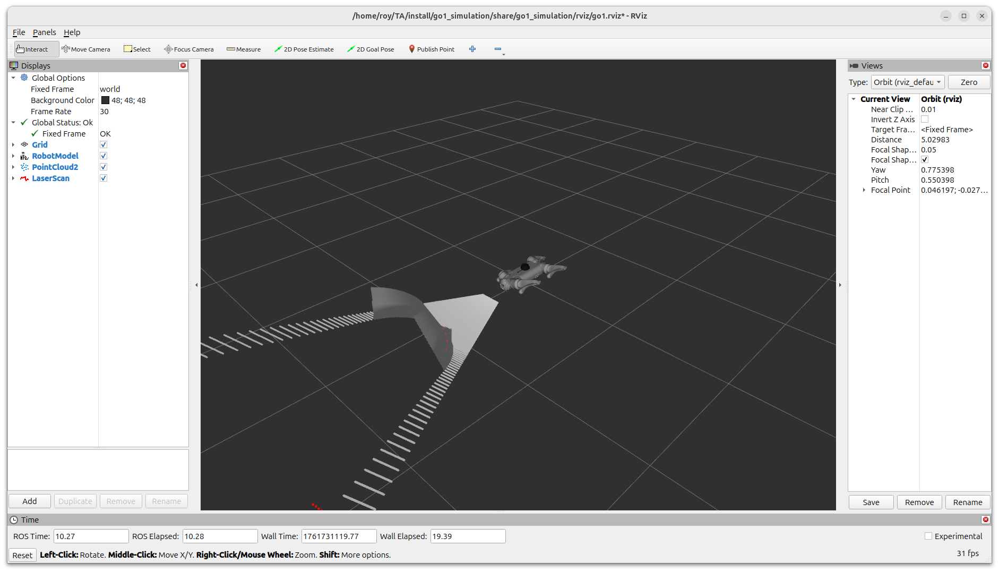
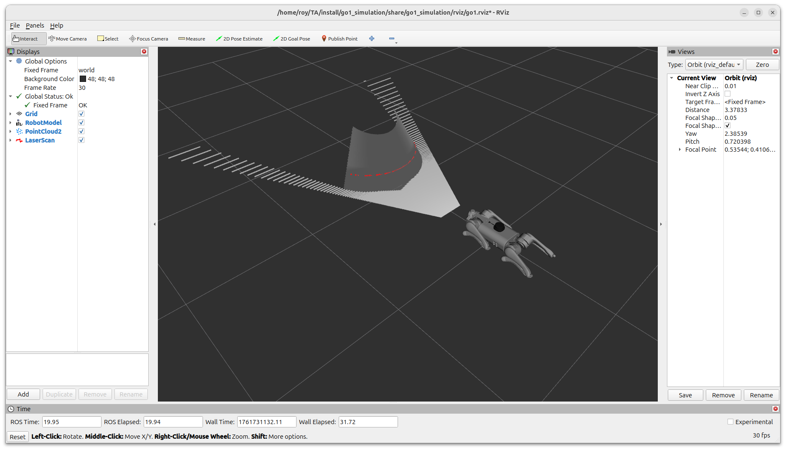
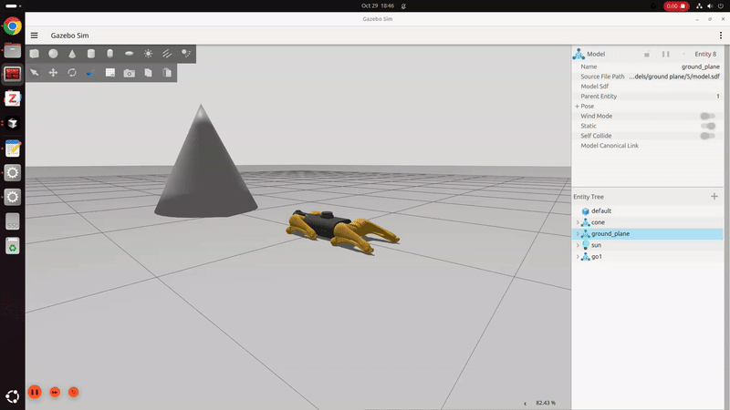

# ROS2 Practice Repository of "How to make a robot with artificial intelligence" Class.

This repository is for ROS2 practice of 2025 Fall "How to Make a Robot with Artificial Intelligence" class.

It contains a collection of ROS2 packages for simulating and controlling the Unitree Go1 quadruped robot.

---

## ⚠️ Caution (Only After Git Clone)
This repository is currently under active development and **frequent updates** may occur.

To ensure you are working with the **latest version** of this project, please run the following command in your terminal:

```bash
git pull origin main
```

Be careful not to remove your local changes

---

## 🔧 Prerequisites

- **Operating System**: Ubuntu 24.04
- **ROS2 Distribution**: Jazzy Jalisco
- **Gazebo**: Harmonic

---

## 📦 Packages Overview

### 1. **go1_simulation**
Gazebo Harmonic simulation environment for the Unitree Go1 robot with full ROS2 integration.
- URDF/Xacro robot description
- Gazebo world files
- ROS2 control integration
- Ground truth pose publisher
- Keyboard teleoperation

### 2. **path_tracker**
MPPI (Model Predictive Path Integral) based path tracking controller for mobile robots.
- C++ implementation of MPPI algorithm
- Python example script for path generation
- Visualization tools for RViz
- Real-time trajectory tracking

### 3. **ros2_unitree_legged_controller**
ROS2 control interface for Unitree legged robots.
- Custom ROS2 controller plugin
- Joint-level control interface
- Compatible with ros2_control framework
- Hardware abstraction layer

### 4. **ros2_unitree_legged_msgs**
Custom ROS2 message definitions for Unitree robots.
- Motor command/state messages
- High-level command/state messages
- IMU, BMS, and sensor messages
- Compatible with Unitree SDK

### 5. **unitree_guide2**
High-level locomotion controller for Unitree Go1 robot.
- Finite State Machine (FSM) for gait control
- Balance control and estimation
- Trotting gait implementation
- ROS2 integration for simulation


---

## 📥 Installation

### Step 1: Clone the Repository

```bash
cd ~
git clone https://github.com/roy9852/make_ai_robot.git

```

### Step 2: Install Dependencies

Use `rosdep` to automatically install all required dependencies:

```bash
cd ~/make_ai_robot
rosdep install -i --from-path src --rosdistro $ROS_DISTRO -y
```

This will install:
- Gazebo Harmonic and ROS2 integration (`ros_gz_sim`, `ros_gz_bridge`)
- All ROS2 packages (rclcpp, rclpy, tf2, ros2_control, etc.)
- System dependencies (Eigen, Boost, etc.)

### Step 3: Build the Workspace

```bash
colcon build
```

You should see:
```bash
Starting >>> ros2_unitree_legged_msgs
Starting >>> path_tracker
Finished <<< ros2_unitree_legged_msgs [8.90s]                                    
Starting >>> ros2_unitree_legged_control
Starting >>> unitree_guide2
Finished <<< ros2_unitree_legged_control [11.9s]                        
Starting >>> go1_simulation
Finished <<< path_tracker [21.5s]                                       
Finished <<< go1_simulation [1.59s]                                      
Finished <<< unitree_guide2 [19.3s]                       

Summary: 5 packages finished [28.3s]
```

### Step 4: Source the Workspace

```bash
source install/setup.bash
```

Add to your `~/.bashrc` for automatic sourcing:
```bash
echo "source ~/your_workspace/install/setup.bash" >> ~/.bashrc
```

### Understanding the Workspace Structure

After building, your workspace will have these directories:

```
your_workspace/
├── src/                    # Source code (you edit files here)
│   ├── go1_simulation/
│   ├── path_tracker/
│   ├── ros2_unitree_legged_controller/
│   ├── ros2_unitree_legged_msgs/
│   └── unitree_guide2/
├── build/                  # Temporary build files (auto-generated)
├── install/                # Compiled packages (auto-generated)
└── log/                    # Build logs (auto-generated)
```

**Important Notes:**
- Only edit files in `src/` directory
- Never manually edit files in `build/`, `install/`, or `log/`
- If build fails, you can safely delete `build/`, `install/`, and `log/` and rebuild
- Always source `install/setup.bash` after building

---

## 🚀 Usage

### 1. Launch Go1 Simulation in Gazebo

Start the complete simulation environment:

```bash
ros2 launch go1_simulation go1.gazebo.launch.py use_gt_pose:=true
```

You should see both Gazebo and RViz:





**Launch Arguments:**
- `world_file:=<world_name>.world` - Choose world (empty, cafe, house)
- `x:=0.0 y:=0.0 z:=0.5` - Initial robot position
- `use_gt_pose` - Use Ground Truth (GT) pose of "trunk" link for localization (Data is from Gazebo)

**Example:**
```bash
ros2 launch go1_simulation go1.gazebo.launch.py use_gt_pose:=true world_file:=cafe.world x:=2.0 y:=3.0
```

### 2. Unitree Guide Controller

Run the high-level locomotion controller:

```bash
ros2 run unitree_guide2 junior_ctrl
```

After you run this node, press a number key (1-5) to change robot's status in the same CLI

**Robot Status (FSM States)**
- **Number 1**: Passive mode - Robot is passive, no joint control (initialization)
- **Number 2**: Fixed stand - Robot stands up with fixed position
- **Number 3**: Free stand - Robot stands up with balance control (can adapt to external forces)
- **Number 4**: Trotting - Robot performs trotting gait (not recommended without proper setup)
- **Number 5**: Move base - Robot can move using `/cmd_vel` commands (velocity control mode)

**Operation Order After Running Node (5 Steps):**
- **Step 1**: Spawn the robot in Gazebo environment
- **Step 2**: Press number 1 for initialization
- **Step 3**: Press number 2 to stand up the robot
- **Step 4**: After the robot stands up, press number 5. Then the robot's body will drop slightly
- **Step 5**: Now, you can move your robot with `/cmd_vel` topic



### Keyboard Teleoperation

Control the robot with keyboard after running `junior_ctrl` node:

```bash
ros2 run go1_simulation move_go1_with_keyboard.py
```

You can also use a CLI command (this command is for rotation):
```bash
ros2 topic pub /cmd_vel geometry_msgs/msg/Twist "{linear: {x: 0.05, y: 0.0, z: 0.0}, angular: {x: 0.0, y: 0.0, z: 0.2}}" -r 10
```

### 3. Path Tracking

**Step 1**: Launch the MPPI path tracker:

```bash
ros2 launch path_tracker path_tracker_launch.py
```

**Step 2**: Generate and follow a path to specific pose:

```bash
# Move to position (x=2.0 meter, y=1.0 meter) with yaw=0 rad orientation
ros2 run path_tracker move_robot.py 2.0 1.0 0.0
```

**Step 3**: Check!:
```bash 
# Read x, y, z, qx, qy, qz, qw and compare with your command
# You need to convert the quaternion to a yaw angle
ros2 topic echo /go1_pose
```

**How it works:**
1. The path tracker subscribes to `/local_path` (desired path)
2. It uses `/go1_pose` (current robot position) for feedback
3. It publishes `/cmd_vel` commands to move the robot
4. MPPI algorithm optimizes the control commands in real-time

**Tips:**
- Make sure the robot is in "move base" mode (press 5 in `junior_ctrl` terminal)
- The robot will generate a smooth curved path to the target

---

## 📝 Assignment:

### 1. Localization Module

**Goal**: Create your own localization module without using ground truth (GT) pose from Gazebo.

**What you need to do:**

Create a ROS2 node (Python or C++) that:
1. Subscribes to sensor data (e.g., `/scan`, `/imu_plugin/out`, `/camera_face/depth`)
2. Estimates the robot's position and orientation
3. Publishes `/go1_pose` topic (geometry_msgs/msg/PoseStamped)
4. Broadcasts transformation to `/tf` connecting `world` frame and `base` frame

**Learning Steps:**
1. **Study the reference**: Read `go1_gt_pose_publisher.py` to understand:
   - How to publish PoseStamped messages
   - How to broadcast TF transforms
   - The required update rate (minimum 10Hz for MPPI)

2. **Choose your approach**: Some options:
   - **Particle Filter** with 2D Lidar (`/scan` topic) - Recommended
   - **Sensor Fusion** combining IMU, odometry, and lidar
   - **Visual Odometry** using depth camera
   - **EKF (Extended Kalman Filter)** with multiple sensors

3. **Get map data**: You'll need a map for localization
   - Create or load a 2D occupancy grid map
   - Publish it on `/map` topic (nav_msgs/msg/OccupancyGrid)
   - You can use SLAM tools or pre-build a map

**Performance Requirements:**
- Update rate: ≥ 10Hz
- Position accuracy: Better than ±0.5m for path tracking to work well
- Low latency: Process sensor data quickly

**Why this matters**: The path tracker relies on accurate robot pose estimation. Without good localization, the robot won't know where it is and can't follow paths correctly!

**Related Topics:**
| Topic | Message Type | Description |
|-------|--------------|-------------|
| `/go1_pose` | geometry_msgs/msg/PoseStamped | Robot pose (x, y, z, qx, qy, qz, qw)|
| `/tf` | tf2_msgs/msg/TFMessage | Transformation tree information between links |
| `/map` | nav_msgs/msg/OccupancyGrid | 2D occupancy grid map for localization (you need to create this) |
| `/scan` | sensor_msgs/msg/LaserScan | 2D Lidar data |
| `/camera_face/camera_info` | sensor_msgs/msg/CameraInfo | Camera information of face camera |
| `/camera_face/image` | sensor_msgs/msg/Image | RGB image of face camera |
| `/camera_face/depth` | sensor_msgs/msg/Image | Depth image of face camera |
| `/camera_face/points` | sensor_msgs/msg/PointCloud2 | Colored point cloud of face camera |
| `/imu_plugin/out` | sensor_msgs/msg/Imu | IMU measurements |

**⚠️ Important Reminder**: Do NOT use ground truth pose from Gazebo (like `go1_gt_pose_publisher.py` does). The goal is to estimate the pose using only realistic sensor data that would be available on a real robot!

---

### 2. Path Planner Module
You should make your path planner module for MPPI path tracker.

TBD - Do not change here yet

### 3. Perception Module
You should make your perception module.

TBD - Do not change here yet

---

## 💡 Helpful Tips for ROS2 Beginners

### Useful ROS2 Commands

**Check available topics:**
```bash
ros2 topic list
```

**Monitor a topic in real-time:**
```bash
ros2 topic echo /go1_pose
```

**Check topic information:**
```bash
ros2 topic info /scan
```

**Visualize tf tree:**
```bash
ros2 run tf2_tools view_frames
# This creates a PDF file showing all transformations
```

**Record data for later analysis:**
```bash
ros2 bag record -a  # Record all topics
ros2 bag record /scan /go1_pose  # Record specific topics
```

**Play recorded data:**
```bash
ros2 bag play <bag_file>
```

**Check node information:**
```bash
ros2 node list
ros2 node info /path_tracker
```

### Working with Multiple Terminals

ROS2 typically requires multiple terminal windows. Here's a suggested workflow:

1. **Terminal 1**: Launch Gazebo simulation
2. **Terminal 2**: Run robot controller (`junior_ctrl`)
3. **Terminal 3**: Run additional nodes (keyboard control, path tracker, etc.)
4. **Terminal 4**: Monitor topics and debugging

💡 **Pro tip**: Use terminal multiplexers like `tmux` or `terminator` for easier management!

---

## 🔍 Troubleshooting

### Build Warnings
All packages are configured to build cleanly. If you see warnings, try to build again:
```bash
rm -rf build install log
colcon build
```

### Gazebo Not Found
Ensure Gazebo Harmonic is installed:
```bash
sudo apt update
sudo apt install ros-${ROS_DISTRO}-ros-gz
```

### Missing Dependencies
Re-run rosdep:
```bash
rosdep update
rosdep install -i --from-path src --rosdistro $ROS_DISTRO -y
```

### "Command not found" Error
If ROS2 commands are not found, make sure you've sourced the ROS2 installation:
```bash
source /opt/ros/jazzy/setup.bash
source ~/your_workspace/install/setup.bash
```

### Robot Doesn't Walk Well
**Common causes:**
1. Check Real Time Factor (RTF) of the simulation (right below of the GUI). It should be above 60% for normal operation.
2. Check the frequency (Hz) of `/imu_plugin/out`. It should be above 500 Hz for normal operation.
3. If you use a higher-performance computer, the problem might be solved.

### Robot Doesn't Move
**Common causes:**
1. Robot is not in "move base" mode → Press `5` in the `junior_ctrl` terminal
2. Controller not running → Check if `junior_ctrl` node is running
3. Path tracker not receiving pose → Check `ros2 topic echo /go1_pose`
4. Simulation paused → Click play button in Gazebo

### Controller Not Loading
Check controller manager status after running `go1.gazebo.launch.py`:
```bash
ros2 control list_controllers
```

You should see 13 active controllers (12 joint controllers + 1 joint state broadcaster):
```bash
FL_thigh_controller     ros2_unitree_legged_control/UnitreeLeggedController  active
FR_thigh_controller     ros2_unitree_legged_control/UnitreeLeggedController  active
FR_hip_controller       ros2_unitree_legged_control/UnitreeLeggedController  active
RR_thigh_controller     ros2_unitree_legged_control/UnitreeLeggedController  active
RR_calf_controller      ros2_unitree_legged_control/UnitreeLeggedController  active
FL_calf_controller      ros2_unitree_legged_control/UnitreeLeggedController  active
RL_hip_controller       ros2_unitree_legged_control/UnitreeLeggedController  active
FR_calf_controller      ros2_unitree_legged_control/UnitreeLeggedController  active
RL_calf_controller      ros2_unitree_legged_control/UnitreeLeggedController  active
FL_hip_controller       ros2_unitree_legged_control/UnitreeLeggedController  active
joint_state_broadcaster joint_state_broadcaster/JointStateBroadcaster        active
RL_thigh_controller     ros2_unitree_legged_control/UnitreeLeggedController  active
RR_hip_controller       ros2_unitree_legged_control/UnitreeLeggedController  active
```
